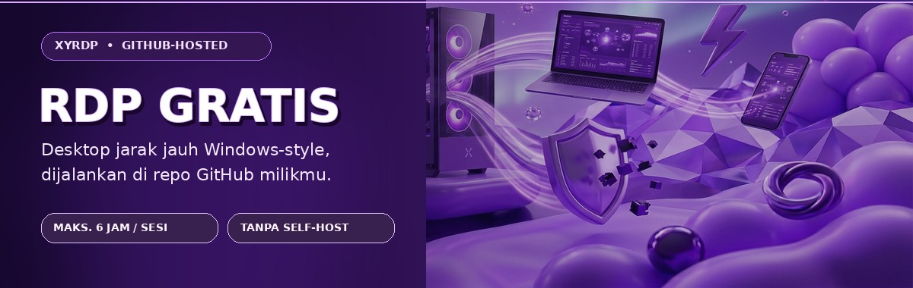

<div align="center">
  
  <p><strong>RDP Windows-style dari HP atau PC · repo sendiri · tanpa self-host</strong></p>
  <p>
    <a href="https://xyrdp-dash.vercel.app/panduan">📘 Panduan langkah demi langkah</a> ·
    <a href="https://xyrdp-dash.vercel.app">🚀 Buka dashboard</a> ·
    <a href="https://whatsapp.com/channel/0029VbB7nwuJZg3ym6UQ4Z1L">📣 Join Saluran XyVerse</a>
  </p>
</div>

> **Gratis untuk mulai**, tetapi pemakaian tetap mengikuti kuota, batas, dan kebijakan GitHub Actions, Tailscale, serta layanan terkait. Satu sesi berjalan pada runner sementara dan maksimal **6 jam**.

XyRDP menyiapkan desktop jarak jauh **Windows-style** pada runner GitHub-hosted. Setiap pengguna login dengan GitHub dan menjalankan sesi di **repo GitHub miliknya sendiri**. Dashboard hanya membantu membuat repo dari template, mengatur workflow, dan memantau sesi.

## ✨ Fitur utama

- **Multi-user:** login GitHub → repo kerja pribadi dari template → Actions berjalan di repo pengguna.
- **Kontrol sesi:** mulai/hentikan, pilih durasi, lihat alamat terbaru, status dan log.
- **Jalur HP:** Tailscale + [XyDesk Remote](https://github.com/xykal/XyDesk-Remote); tunnel/RustDesk tersedia sebagai opsi.
- **Tampilan desktop:** Windows Server 2022 dengan tweak bergaya Windows 10 (bukan edisi Windows 10 asli).
- **Grafis kompatibel:** Mesa llvmpipe untuk OpenGL dan lavapipe untuk Vulkan. Ini render **software berbasis CPU**, bukan GPU fisik.
- **Wallpaper tertanam:** gambar di `assets/wallpaper.jpg` dan `assets/wallpaper-win10.jpg` ikut di-checkout workflow, lalu diterapkan ke desktop dan latar login runner.
- **Panduan sebelum mulai:** popup halaman pertama dan panduan interaktif di [`/panduan`](https://xyrdp-dash.vercel.app/panduan).
- **Admin dashboard:** login email + kata sandi hanya lewat environment Vercel, cookie HttpOnly, pemeriksaan Turnstile, dan pembatasan percobaan login.

## 🚀 Cara pakai

1. Buka [dashboard XyRDP](https://xyrdp-dash.vercel.app) dan baca [panduan lengkap](https://xyrdp-dash.vercel.app/panduan).
2. Tekan **Masuk dengan GitHub**. Repo kerja dibuat pada akunmu sendiri dari template XyRDP.
3. Tambahkan dua **Repository secrets** di `Settings → Secrets and variables → Actions`:

   | Nama secret | Isi |
   |---|---|
   | `RDP_PASSWORD` | Kata sandi unik untuk login ke desktop RDP. Jangan gunakan ulang kata sandi akun lain. |
   | `TAILSCALE_AUTH_KEY` | Auth key Tailscale milikmu. Pilih reusable; ephemeral disarankan jika tersedia. |

4. Kembali ke dashboard, periksa repo sampai statusnya **siap**, pilih durasi/jalur, lalu tekan **NYALAKAN**.
5. Setelah status **AKTIF**, buka Tailscale di HP dan login ke akun yang membuat key tadi. Di XyDesk Remote pilih **Koneksi RDP Penuh**: Host = IP `100.x` dari dashboard, Port = `3389`, user = `xyadmin`, sandi = nilai `RDP_PASSWORD`-mu.
6. Simpan pekerjaan ke penyimpananmu sendiri. Tekan **MATIKAN** jika selesai; VM juga berhenti otomatis saat durasi habis.

Secret opsional: `NGROK_AUTHTOKEN` (tunnel ngrok) dan `CLEANUP_TOKEN` (pembersihan run lama). Nilai secret dimasukkan langsung di GitHub—**jangan** dikirim lewat chat, issue, screenshot, atau commit.

## 🔒 Pembatasan run Actions

Workflow utama memeriksa `github.actor == github.repository_owner` sebelum job runner dimulai. Artinya, pada repo pengguna hanya **pemilik repo** yang dapat memulai sesi; anggota/collaborator yang bukan pemilik tidak akan menjalankan job RDP. Setiap orang tetap dapat menjalankan workflow di repo miliknya sendiri.

## ⚠️ Batasan penting

- Bukan Windows 10 desktop asli. Runner yang tersedia adalah Windows Server 2022 dengan tampilan/tweak Windows 10.
- Runner **ephemeral**: aplikasi/file yang disimpan di disk VM bisa hilang saat sesi berakhir. Simpan data penting di tempat lain.
- Mesa menyediakan API OpenGL/Vulkan lewat CPU; grafis 3D berat dan render video akan lambat.
- Durasi maksimum job pada workflow ini 360 menit. Kuota/biaya mengikuti plan dan kebijakan terbaru platform masing-masing.
- Satu sesi per repo. Jangan gunakan VM untuk data rahasia atau pekerjaan yang melanggar kebijakan penyedia layanan.
- Repo yang dibuat dari template adalah salinan mandiri; perubahan template tidak otomatis disinkronkan ke repo pengguna yang sudah ada.

## 🧭 Komponen repo

| Path | Peran |
|---|---|
| `.github/workflows/rdp-6h.yml` | Workflow Windows-hosted, batas 6 jam, pemilik repo saja |
| `scripts/setup-rdp.ps1` | User lokal dan layanan RDP |
| `scripts/setup-win10.ps1` | Tweak tampilan, wallpaper desktop dan latar login |
| `scripts/setup-grafis.ps1` | Mesa llvmpipe + Vulkan lavapipe |
| `scripts/setup-akses.ps1` | Tailscale, tunnel, dan RustDesk |
| `scripts/setup-extras.ps1` | Wallpaper, Lightshot, dan taskbar |
| `assets/wallpaper.jpg` | Wallpaper sesi default |
| `assets/wallpaper-win10.jpg` | Wallpaper Windows-style dan latar login |
| `assets/rdp-extras.json` | Pengaturan ekstra dashboard/workflow |
| `deploy/vercel/` | Dashboard ter-host (API, halaman login, panduan) |
| `PANDUAN-PENGGUNA.md` | Petunjuk teks untuk pengguna baru |

## 🛠️ Deploy dashboard (pemilik)

Dashboard ter-host menggunakan Vercel Functions tanpa dependency eksternal. Env harus disimpan di **Vercel Project Settings → Environment Variables**, bukan di repo:

- Inti: `GITHUB_TOKEN`, `GH_OWNER`, `GH_REPO`, `GH_WORKFLOW`, `GH_BRANCH`, `RDP_USER`, `RDP_PASSWORD`.
- Admin: `AUTH_USER`, `AUTH_PASS`, `SESSION_SECRET`.
- Proteksi login admin: `TURNSTILE_SITE_KEY`, `TURNSTILE_SECRET_KEY` (secret key bertipe sensitive/encrypted), opsional `TURNSTILE_HOSTNAME`.
- Multi-user: `GITHUB_OAUTH_CLIENT_ID`, `GITHUB_OAUTH_CLIENT_SECRET`, `TEMPLATE_REPO`, `OWNER_LOGIN`.

Jangan menaruh nilai token, kata sandi, OAuth secret, atau Tailscale auth key di README, JavaScript klien, atau commit Git. Gunakan sandi admin unik; rotasi kredensial jika pernah dibagikan.

Untuk menjalankan dashboard lokal, salin `web/config.example.json` ke `web/config.json`, isi token lokal secara privat, lalu jalankan. Server lokal bind ke `127.0.0.1` secara default supaya PAT di config tidak terbuka ke jaringan. Mode lokal adalah mode tepercaya tanpa form login; jangan mengubah bind host menjadi `0.0.0.0` di jaringan publik:

```bash
cd web
node server.js
```

Buka `http://localhost:4173`. File `web/config.json` sudah masuk `.gitignore`.

## 📣 Komunitas

- [Join Saluran XyVerse Technology Global (WhatsApp)](https://whatsapp.com/channel/0029VbB7nwuJZg3ym6UQ4Z1L)
- [Gabung Grup XyCloud (WhatsApp)](https://chat.whatsapp.com/DpROBXmeUHJGcXecfxP6n7?s=cl&p=a&ilr=2&amv=0)
- [Panduan pengguna](PANDUAN-PENGGUNA.md) · [Dashboard](https://xyrdp-dash.vercel.app)

<sub>XyRDP adalah proyek komunitas dan bukan produk resmi GitHub, Microsoft, Cloudflare, Tailscale, atau XyDesk.</sub>
